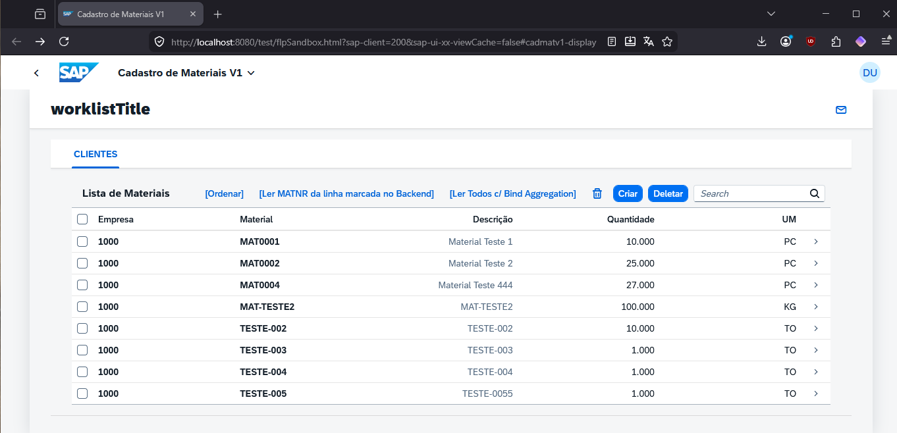

## Application Details
|               |
| ------------- |
|**Generation Date and Time**<br>Wed Mar 11 2026 19:37:00 GMT-0300 (Brasilia Standard Time)|
|**App Generator**<br>@sap/generator-fiori-freestyle|
|**App Generator Version**<br>1.10.1|
|**Generation Platform**<br>Visual Studio Code|
|**Template Used**<br>simple|
|**Service Type**<br>SAP System (ABAP On Premise)|
|**Service URL**<br>https://cromos.opus-idc.com.br:44300/sap/opu/odata/sap/ZGCAD_MAT270_SRV
|**Module Name**<br>cadmatv1|
|**Application Title**<br>Cadastro de Materiais V1|
|**Namespace**<br>|
|**UI5 Theme**<br>sap_horizon|
|**UI5 Version**<br>1.145.0|
|**Enable Code Assist Libraries**<br>False|
|**Enable TypeScript**<br>False|
|**Add Eslint configuration**<br>False|

## cadmatv1

Cadastro de Materiais V1

### Starting the generated app

-   This app has been generated using the SAP Fiori tools - App Generator, as part of the SAP Fiori tools suite.  In order to launch the generated app, simply run the following from the generated app root folder:

```
    npm start
```

### APP IMAGES




