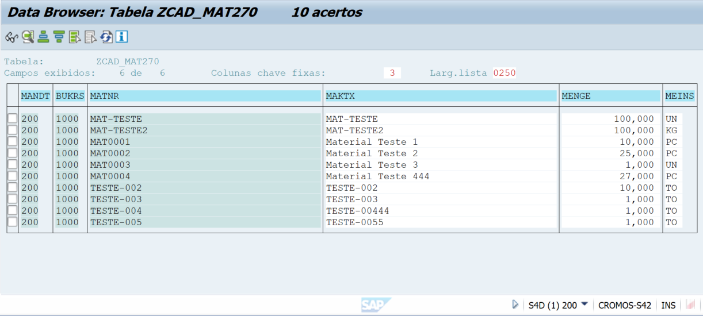
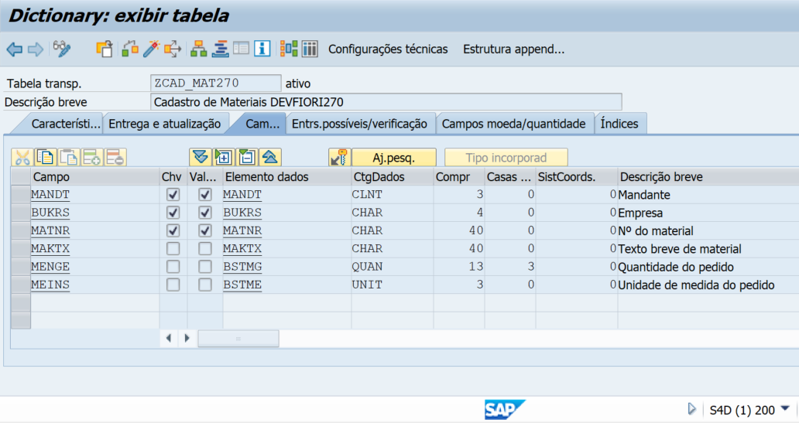
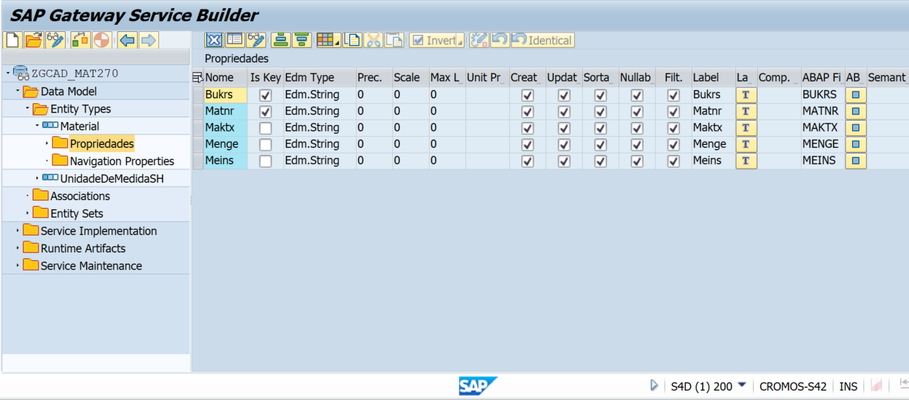
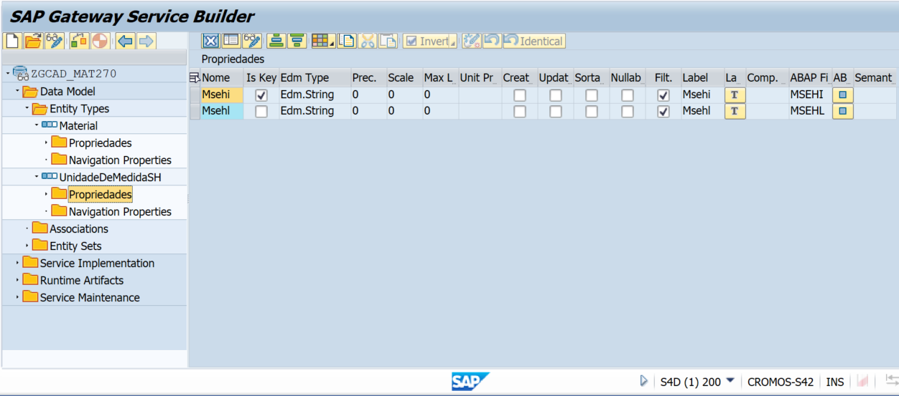
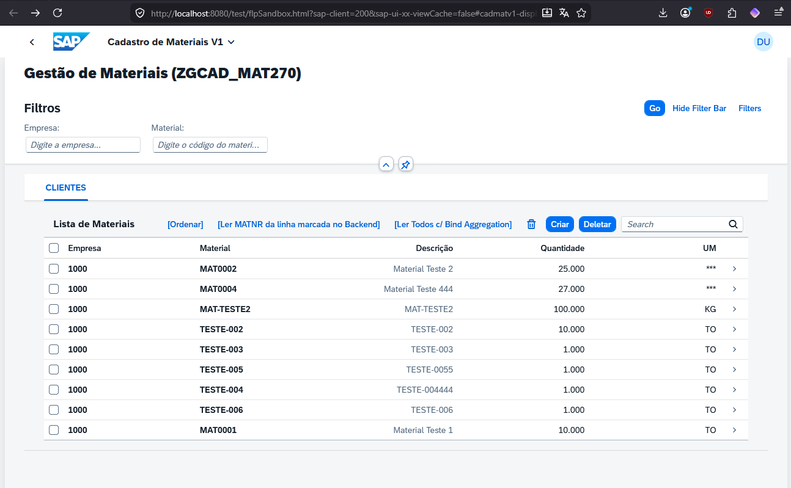

## Application Details
|               |
| ------------- |
|**Generation Date and Time**<br>Wed Mar 11 2026|
|**Service Type**<br>SAP System (ABAP On Premise)|
|**Service URL**<br>https://cromos.opus-idc.com.br:44300/sap/opu/odata/sap/ZGCAD_MAT270_SRV

## cadmatv1

Cadastro de Materiais V1  
View1: É a view principal (Worklist)  
Object: É a view detalhe de Visualização ou Modificação  
Create: É a view de Criação  

### Starting the generated app

```
    npm start
```

### APP IMAGES











